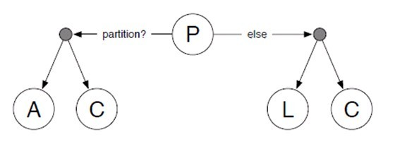

# ACID and CAP Theorome
imazine@company100

## ACID
> ACID(원자성, 일관성, 고립성, 지속성)는 데이터베이스 트랜젝션이 안전하게 수행된다는 것을 보장하기 위한 성질을 가리키는 약어이다. 짐 그레이는 1970년대 말에 신뢰할 수 있는 트랜잭션 시스템의 이러한 특성들을 정의하였으며 자동으로 이들을 수행하는 기술을 개발해 냈다.

## ACID details

## *A*tomicity
> 원자성(Atomicity)은 트랜잭션과 관련된 작업들이 모두 수행되었는지 아니면 모두 실행이 안되었는지를 보장하는 능력이다. 자금 이체는 성공할 수도 실패할 수도 있지만 원자성은 중간 단계까지 실행되고 실패하는 일은 없도록 하는 것이다. 

## *C*onsistency
> 일관성(Consistency)은 트랜잭션이 실행을 성공적으로 완료하면 언제나 일관성 있는 데이터베이스 상태로 유지하는 것을 의미한다. 무결성 제약이 모든 계좌는 잔고가 있어야 한다면 이를 위반하는 트랜잭션은 중단된다.

## *I*solation
> 고립성(Isolation)은 트랜잭션을 수행 시 다른 트랜잭션의 연산 작업이 끼어들지 못하도록 보장하는 것을 의미한다. 이것은 트랜잭션 밖에 있는 어떤 연산도 중간 단계의 데이터를 볼 수 없음을 의미한다. 은행 관리자는 이체 작업을 하는 도중에 쿼리를 실행하더라도 특정 계좌간 이체하는 양 쪽을 볼 수 없다. 공식적으로 고립성은 트랜잭션 실행내역은 연속적이어야 함을 의미한다. 성능관련 이유로 인해 이 특성은 가장 유연성 있는 제약 조건이다. 자세한 내용은 관련 문서를 참조해야 한다.

## *D*urability
> 지속성(Durability)은 성공적으로 수행된 트랜잭션은 영원히 반영되어야 함을 의미한다. 시스템 문제, DB 일관성 체크 등을 하더라도 유지되어야 함을 의미한다. 전형적으로 모든 트랜잭션은 로그로 남고 시스템 장애 발생 전 상태로 되돌릴 수 있다. 트랜잭션은 로그에 모든 것이 저장된 후에만 commit 상태로 간주될 수 있다.

## 결국은 RDBMS 의 Lock 이야기
- 결국 DB를 만들때 기준이 되어주는 이야기
- 하지만 사용시에도 이를 지키기 위해 고려해 봐야 한다
- 하지만 Network 환경이라면?

## Network 환경에서의 ACID 보장
- Lock 의 대안 
	- Lock 없이 transaction 을 구현하기 위해 [MVCC](http://ko.wikipedia.org/wiki/%EB%8B%A4%EC%A4%91_%EB%B2%84%EC%A0%84_%EB%8F%99%EC%8B%9C%EC%84%B1_%EC%A0%9C%EC%96%B4) (다중동시성제어)를 사용
- 2단계 커밋 [Two Pharse Commit/2PC](http://ko.wikipedia.org/wiki/2%EB%8B%A8%EA%B3%84_%EC%BB%A4%EB%B0%8B_%ED%94%84%EB%A1%9C%ED%86%A0%EC%BD%9C)
	- Transaction 의 Commit 여부를 각 사용자로부터 확인(2단계Lock 이라고도 불림) 

## CAP Theorem
- CAP Theorem 혹은 Brew Theorem 이라고 불리운다
	- Consistency(일관성)
	- Availability(가용성)
	- Partirion tolerance(분할내성)
- 다음과 같은 세 가지 조건을 모두 만족하는 분산 컴퓨터 시스템

## CAP Theorem details

## *C*onsistency
> 일관성(Consistency): 모든 노드가 같은 순간에 같은 데이터를 볼 수 있다.

## *A*vailability 
> 가용성(Availability): 모든 요청이 성공 또는 실패 결과를 반환할 수 있다.

## Partition tolerance
> 분할내성(Partition tolerance): 메시지 전달이 실패하거나 시스템 일부가 망가져도 시스템이 계속 동작할 수 있다.

## 뭔가 이상하다
- Network 상의 Distuributed 상황에서 P 가 보장되어도 CA를 모두 충족할 수 있는가?

## 수정된 사항
- Partition tolerance : The network will be allowed to lose arbitrarily many messages sent from one node to another
- CAP 세 가지 조건을 모두 만족하는 분산 컴퓨터 시스템이 존재하지 않음을 증명한 정리이다.

## 그래도 부족하다
- P 상황에서 A와 C는 공존할 수 없다
- Distributed 를 전제로 하면 P가 아닌 상황은 있을 수 없다
- 결국 P는 기본으로 들어가야 한다.

## 그래서 One more thing
> Daniel Abadi가 [PACELC](http://cs-www.cs.yale.edu/homes/dna/papers/abadi-pacelc.pdf)라는 표기법을 제시하였다.

## PACELC diagram
(http://eincs.com/2013/07/misleading-and-truth-of-cap-theorem)

## QNA
살살요

## Referencies
- [ACID - wiki](http://en.wikipedia.org/wiki/ACID)
- [MVCC - wiki](http://en.wikipedia.org/wiki/Multiversion_concurrency_control)
- [2PC - wiki](http://en.wikipedia.org/wiki/Two-phase_commit_protocol)
- [CAP Theorem - wiki](http://en.wikipedia.org/wiki/CAP_theorem)
- [CAP Theorem 오해와 진실- blog](http://eincs.com/2013/07/misleading-and-truth-of-cap-theorem/)
- [PACELC - pdf](http://cs-www.cs.yale.edu/homes/dna/papers/abadi-pacelc.pdf)

# Thanks

